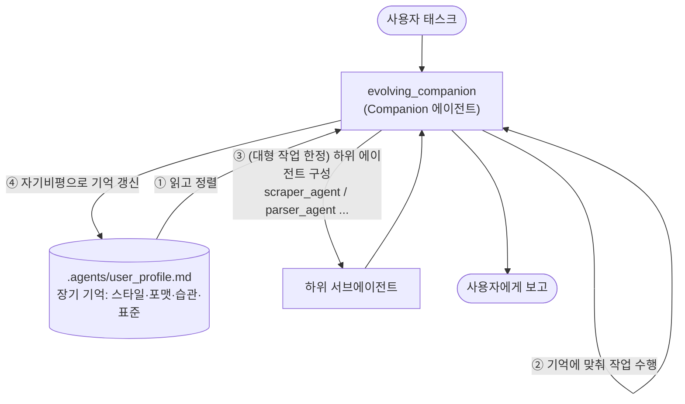
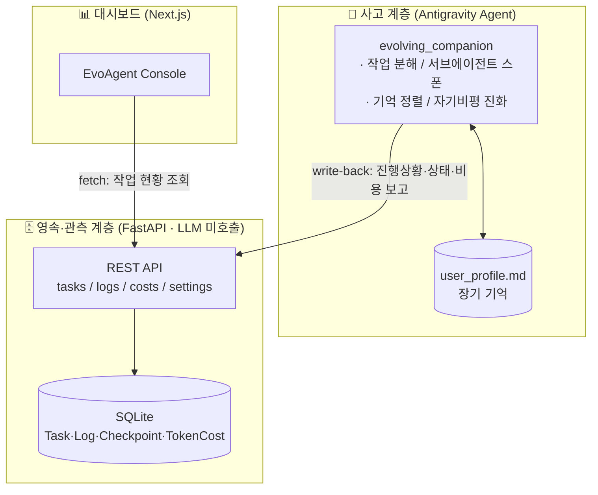
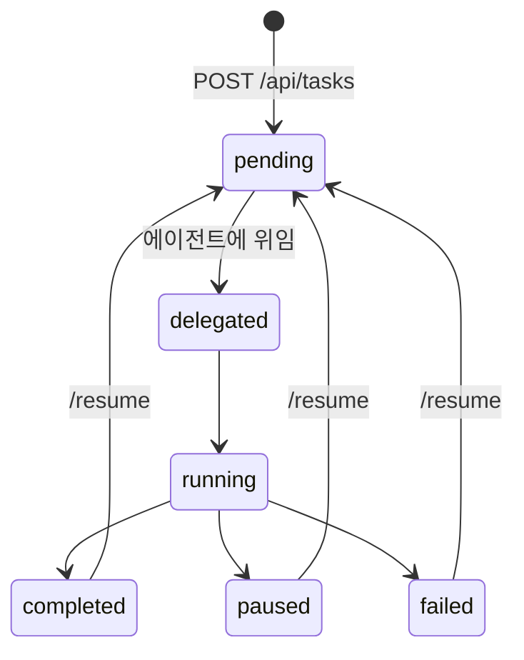

<div align="center">

# 🧠 Evolving Agent Platform (EAP)

**나를 기억하고, 쓸수록 나에게 맞게 진화하는 AI 동반자**

세션·서비스가 바뀌어도 끊기지 않는 "사용자에게 귀속된 장기 기억"을 핵심으로, 매 작업마다 자기비평을 거쳐 진화하는 에이전트 플랫폼

<!-- 기술 배지 -->


</div>

---

## 📑 목차

- [한눈에 보기](#-한눈에-보기)
- [무엇을 해결하나](#-무엇을-해결하나)
- [동작 원리](#️-동작-원리)
- [시스템 아키텍처](#️-시스템-아키텍처)
- [기술적 도전과 의사결정](#-기술적-도전과-의사결정)
- [데이터 모델 & Task 상태머신](#️-데이터-모델--task-상태머신)
- [기술 스택](#-기술-스택)
- [API 명세](#-api-명세)
- [실행 방법](#-실행-방법)
- [프로젝트 구조](#-프로젝트-구조)
- [알려진 한계와 개선 방향](#️-알려진-한계와-개선-방향)
- [로드맵](#️-로드맵)

---

## 🔎 한눈에 보기

| 항목 | 내용 |
| --- | --- |
| **프로젝트 유형** | 개인 프로젝트 (제품 기획 · 아키텍처 설계 · 백엔드 · 프론트엔드 단독 수행) |
| **한 줄 정의** | 사용자 맥락을 장기 기억으로 축적·진화시키는 **자가진화형 멀티 에이전트 플랫폼** |
| **핵심 아이디어** | "기억 → 정렬 → 작업 → 자기비평 → 진화" 루프. 누적된 사용자 맥락이 곧 해자(moat) |
| **백엔드** | Python · FastAPI · SQLAlchemy 2.0 · SQLite — **LLM 미호출 영속·관측 계층** |
| **프론트엔드** | Next.js (App Router) · TypeScript · TailwindCSS 관측 대시보드 |
| **설계 포인트** | "사고(에이전트)"와 "기록·관측(백엔드)"의 의도적 분리 |

> **이 프로젝트로 보여주고 싶은 것:** 단순 LLM 래퍼가 아니라, **"생각하는 계층"과 "기록하는 계층"을 분리한 아키텍처 결정**, 자기비평으로 자라는 메모리 루프, 그리고 에이전트의 자율 실행을 추적·재현 가능하게 만든 **관측(observability) 설계**.

<!--
📸 EvoAgent Console 대시보드 스크린샷/GIF를 여기에 추가하면 완성도가 올라갑니다.
frontend 를 띄운 뒤 Task 생성 → 로그/비용이 갱신되는 화면을 녹화해 docs/ 에 넣고 삽입하세요.

-->

---

## 🎯 무엇을 해결하나

| 문제 | EAP의 해법 |
| --- | --- |
| **기억의 단절** — 세션·서비스가 바뀌면 내 스타일·맥락이 매번 초기화됨 | `.agents/user_profile.md`에 사용자 스타일·포맷·습관을 **장기 기억**으로 축적. 다른 작업·세션에서도 그대로 이어짐 |
| **고정된 도구** — 쓸수록 나아지지 않고 늘 똑같음 | 매 작업 종료 시 **자기비평 → 진화**. `Current Evolved Standards` 갱신 + `Evolution Log` 기록으로 점점 더 맞춰짐 |
| **개인화의 깊이** — 단순 설정값이 아니라 "나를 아는" 수준 | 누적된 맥락 자체가 해자. 흉내 낼 수 없는 건 기능이 아니라 **그 사용자에 대해 쌓인 기억** |

> 하위 에이전트 스폰(오케스트레이션)은 이 기억을 *활용하는* 부수 능력이지 핵심이 아닙니다. 핵심은 **축적되고 진화하는 사용자 맥락**입니다. (상위 비전: UCOS / Universal Context Layer)

---

## ⚙️ 동작 원리

중심은 **기억 → 정렬 → 작업 → 자기비평 → 진화**의 루프입니다.



1. **기억 정렬 (핵심)** — 작업 시작 시 `user_profile.md`를 읽어(없으면 생성) 언어·톤·출력 포맷·코딩 스타일에 자신을 맞춤. *매번 다시 설명할 필요가 없음.*
2. **맞춤 수행** — 기억에 정렬된 상태로 작업을 처리.
3. **(대형 작업 한정) 하위 팀 구성** — 작업이 클 때만 `define_subagent`/`invoke_subagent`로 전용 하위 에이전트를 꾸려 협업. 작은 작업은 직접 처리.
4. **자가 진화 (핵심)** — 작업 종료 시 자기비평: 이번 산출이 과거보다 나아졌나? `Current Evolved Standards`를 갱신하고 `Evolution Log`에 날짜·근거를 append.
5. **관측 (선택)** — 진행·상태·비용을 백엔드 write-back 엔드포인트로 기록하면 Next.js 대시보드에 반영.

---

## 🏗️ 시스템 아키텍처

이 플랫폼의 핵심 설계 결정은 **"사고하는 계층"과 "기록·관측하는 계층"의 분리**입니다.



**왜 이렇게 나눴나** — 에이전트의 "생각"(분해·스폰·진화)은 Antigravity `evolving_companion`이 담당하고, 백엔드는 **의도적으로 LLM을 호출하지 않습니다.** 백엔드는 작업·로그·비용·체크포인트를 기록하고, 에이전트가 그 결과를 write-back 하면 대시보드가 시각화하는 **순수 영속·관측 레이어**입니다. 덕분에 자율 실행이 *추적·재현 가능*해지고, 사고 로직과 인프라가 독립적으로 진화할 수 있습니다 (→ 로드맵의 Stage B에서 사고 로직의 백엔드 흡수로 발전).

---

## 🚀 기술적 도전과 의사결정

<details open>
<summary><b>① "사고 계층 ↔ 기록 계층" 분리 (관심사 분리)</b></summary>

LLM 호출을 백엔드에 두면 빠르지만, 에이전트의 자율 판단·기억·진화가 인프라에 얽혀 추적이 어려워집니다. 그래서 백엔드(`orchestrator.py`)는 **LLM을 호출하지 않고**, Task를 `delegated` 상태로 표시한 뒤 에이전트가 결과를 보고하도록 했습니다. 사고와 기록이 분리되어 각각 독립적으로 개선됩니다.

```python
# orchestrator.py — 백엔드는 LLM을 호출하지 않는다
task.status = "delegated"   # 에이전트가 픽업해 분해·스폰·보고
```
</details>

<details>
<summary><b>② 자기비평으로 자라는 메모리 루프</b></summary>

에이전트는 작업 종료마다 자기비평을 수행해 `user_profile.md`의 `Current Evolved Standards`를 갱신하고 `Evolution Log`에 날짜·근거를 남깁니다. 기억이 **사용자 소유 파일**에 평문으로 쌓여, 특정 서비스에 갇히지 않고 투명하게 추적·이식 가능합니다.
</details>

<details>
<summary><b>③ 자율 실행을 추적 가능하게 — 관측(Observability) 설계</b></summary>

자율 에이전트의 약점은 "무슨 일이 벌어졌는지 모른다"는 것. 이를 `Task` 단위로 `Log`·`TokenCost`·`Checkpoint`를 1:N으로 묶어 해결했습니다. 에이전트(및 하위 에이전트)가 **write-back 엔드포인트**로 진행상황·비용·상태를 보고하면 대시보드에 실시간 반영됩니다.

```python
@app.post("/api/tasks/{task_id}/logs")   # 에이전트 → 백엔드 진행상황 보고
@app.post("/api/tasks/{task_id}/costs")  # 토큰·비용 추적
@app.post("/api/tasks/{task_id}/status") # 상태 천이 보고
```
</details>

<details>
<summary><b>④ 재개 가능한 Task 상태머신 + 시스템 ON/OFF 제어</b></summary>

Task는 `pending → delegated/running → paused/failed/completed`로 천이하며, 실패·일시정지된 작업은 `/resume`으로 재처리합니다. 또 `Settings`의 `system_active` 토글로 전체 시스템을 정지하면 신규/재개 요청에 **graceful 503**을 반환해, 폭주를 막는 안전장치를 뒀습니다.
</details>

<details>
<summary><b>⑤ FastAPI 베스트프랙티스 적용</b></summary>

`Depends(get_db)` 의존성 주입으로 세션 생명주기를 관리하고, Pydantic v2 스키마로 **요청/응답 모델을 명확히 분리**(`TaskCreate` vs `TaskResponse`)했습니다. 무거운 위임 작업은 `BackgroundTasks`로 비동기 처리해 응답 지연을 없앴고, SQLAlchemy `relationship` + `cascade="all, delete-orphan"`로 연관 데이터 정합성을 보장했습니다.
</details>

---

## 🗃️ 데이터 모델 & Task 상태머신

```mermaid
erDiagram
    SETTINGS {
        bool system_active
        bool learning_active
    }
    TASK ||--o{ LOG : "1:N"
    TASK ||--o{ TOKEN_COST : "1:N"
    TASK ||--o{ CHECKPOINT : "1:N"
    TASK {
        string id PK "uuid"
        text prompt
        string status
        datetime created_at
        datetime updated_at
    }
    LOG { string node_name; text message; string log_level }
    TOKEN_COST { int input_tokens; int output_tokens; float estimated_cost }
    CHECKPOINT { string node_name; text state_data "JSON" }
```



---

## 🧱 기술 스택

| 영역 | 스택 | 비고 |
| --- | --- | --- |
| **기억 / 진화 (핵심)** | `user_profile.md` 장기 기억 + 자기비평 루프 | 사용자 소유 평문 메모리 |
| **Companion 에이전트** | Antigravity `evolving_companion` | 개인화 + 자가진화 |
| 보조 능력 (오케스트레이션) | `define/invoke/manage_subagent` | 대형 작업 시에만 |
| **Backend** | Python 3.11+, FastAPI, SQLAlchemy 2.0, Pydantic v2, SQLite | 영속·관측 계층 (LLM 미호출) |
| **Frontend** | Next.js (App Router), TypeScript, TailwindCSS | EvoAgent Console |
| 향후 도입 예정 | `chromadb`(벡터 기억), `langgraph`, `google-genai` | requirements에 선반영 |

---

## 📡 API 명세 (관측 계층)

| Method | Path | 설명 |
| --- | --- | --- |
| `GET` | `/api/settings` | 시스템 설정 조회 |
| `POST` | `/api/settings` | 시스템/학습 ON·OFF 토글 |
| `POST` | `/api/tasks` | 새 Task 생성 → 에이전트에 위임(`delegated`) |
| `GET` | `/api/tasks/{id}` | Task 상태 조회 |
| `POST` | `/api/tasks/{id}/resume` | 실패/일시정지 Task 재처리 |
| `GET` | `/api/tasks/{id}/logs` · `/costs` | 로그 · 비용 조회 |
| `POST` | `/api/tasks/{id}/status` · `/logs` · `/costs` | **(write-back)** 에이전트 진행상황 보고 |

> 전체 스키마는 서버 구동 후 `/docs` (Swagger UI)에서 확인할 수 있습니다.

---

## ⚙️ 실행 방법

### 사전 준비 — 환경 변수
```bash
cd backend
cp .env.example .env     # GEMINI_API_KEY 등 실제 값 입력 (.env 는 커밋되지 않음)
```

### 1. (선택) 관측 백엔드 — FastAPI
```bash
cd backend
python -m venv venv
venv\Scripts\activate          # macOS/Linux: source venv/bin/activate
pip install -r requirements.txt
uvicorn main:app --reload      # http://localhost:8000  (docs: /docs)
```

### 2. (선택) 대시보드 — Next.js
```bash
cd frontend
npm install
npm run dev                    # http://localhost:3000
```

### 3. Companion 로드 (Antigravity)
서브에이전트 정의는 재시작 시 소실되므로 새 세션마다 레포의 정의를 다시 등록합니다. 자세한 동작/로드 설명은 [`antigravity/README.md`](antigravity/README.md) 참고.

---

## 📂 프로젝트 구조

```
evolving-agent-platform/
├── antigravity/                          # 🧠 기억 · 진화 · companion (핵심)
│   ├── agents/evolving_companion/
│   │   └── agent.json                    # companion 정의 (개인화+자가진화)
│   ├── user_profile.template.md          # 장기기억 템플릿
│   └── README.md                         # 동작 설명
├── backend/                              # 🗄️ 영속·관측 계층 (LLM 미호출)
│   ├── main.py                           # FastAPI 엔드포인트
│   ├── orchestrator.py                   # 위임 코디네이터 (no-LLM)
│   ├── models.py · schemas.py · database.py
│   ├── .env.example                      # 환경변수 템플릿
│   └── requirements.txt
├── frontend/                             # 📊 EvoAgent Console 대시보드
│   └── src/app/page.tsx · src/lib/api.ts
├── docs/cursor_tasks/                    # 감독관-워커 작업 지시서
├── CLAUDE.md                             # 개발 규칙
└── EAP_CONTEXT.md                        # 아키텍처 인수인계 문서
```

자세한 결정 이력은 [`EAP_CONTEXT.md`](EAP_CONTEXT.md), companion 상세는 [`antigravity/README.md`](antigravity/README.md) 참고.

---

## ⚠️ 알려진 한계와 개선 방향

실사용 중 직접 관찰한 문제와, 아키텍처 상 예상되는 구조적 한계를 정리했습니다. 핵심 통찰은 **눈에 보이는 두 증상(느린 위임 · 자식의 기억 망각)이 사실상 "본체가 가진 맥락이 자식에게 전달·회수되지 않는다"는 한 뿌리에서 나온다**는 점입니다.

| 증상 | 근본 원인 | 개선 방향 |
| --- | --- | --- |
| **본체 ↔ 서브에이전트 역할이 모호해 느림** *(실사용 관찰)* | 위임 기준(작업 크기·비용 임계)이 없고 본체/자식의 책임 경계가 프롬프트에 명시되지 않음. 위임 한 번마다 콜드스타트 + 추가 LLM 왕복 비용 발생 | 위임 정책 명문화(임계 휴리스틱), 자식별 **역할 계약(role contract)**·입출력 스키마 고정, 소규모 작업은 본체가 직접 처리 |
| **서브에이전트가 기억을 망각** *(실사용 관찰)* | 자식은 부모의 `user_profile.md`를 상속하지 않음. `agent.json`이 "자식엔 필요한 컨텍스트만" 주도록 설계돼 기억 주입 단계가 빠짐 | 위임 시 관련 **기억 슬라이스(스타일·포맷 표준)를 자식 브리핑에 주입**하거나, 자식도 `user_profile.md`를 읽도록 명시. "기억 다이제스트" 전달 규약화 |
| **메모리 무한 증식·비구조화** | `Evolution Log`가 append-only 평문이라 작업마다 누적 → 중복·모순 쌓이고 읽기 비용·컨텍스트 점유 증가 | 주기적 **통합(consolidation)·중복 제거·decay**, 의미 검색으로 관련 부분만 로드 (로드맵의 `chromadb` 벡터화와 연결) |
| **자기진화의 드리프트** | 단발성 작업이 잘못된 표준을 밀어넣어도 검증 없이 `Current Evolved Standards`가 갱신 → 과적합·진동 위험 | 근거 임계(여러 작업에서 반복 확인된 패턴만 승격)·**롤백**, 중요한 표준 변경은 사용자 확인 |
| **관측 누락 → 좀비 태스크** | 상태 천이가 에이전트의 write-back에 의존. 보고를 빠뜨리면(=위 기억 망각과 동일 뿌리) 대시보드가 stale 해지고 `delegated`에서 영영 멈춤. `running`은 백엔드가 직접 찍지 않음 | **하트비트·타임아웃·주기적 reconcile** 도입, 일정 시간 무보고 시 자동 `stale/failed` 마킹 |
| **메모리 파일 동시 쓰기 경쟁** | `user_profile.md` 단일 파일에 병렬 자식·작업이 동시에 기록하면 last-write-wins로 덮어쓰기 발생 | 파일 락 또는 **단일 writer(본체만 기록)**로 직렬화, 혹은 append-only 구조화 저장소로 분리 |
| **인프라 성숙도** | 백엔드 테스트 부재, 서브에이전트 수동 재등록, 스키마는 `create_all`만(마이그레이션 없음), CORS `*` | 백엔드 테스트 추가, 정의 재등록 자동화, **Alembic 마이그레이션**, 운영용 CORS 제한 |

> 우선순위 관점에서는 **① 위임 정책 + 기억 주입 규약**(역할·기억을 자식에게 명시적으로 전달)이 체감 성능과 일관성을 가장 크게 끌어올릴 레버입니다. 그다음이 **② 관측 하트비트**(좀비 태스크 제거), **③ 메모리 구조화·동시성 제어** 순으로 이어집니다.

---

## 🗺️ 로드맵

- [x] **자가 진화 기억 루프** — `user_profile.md` 기반 개인화 + 자기비평 진화 (핵심)
- [x] **기억·에이전트 정의 버전 관리** — `antigravity/`에 체크인해 재시작 소실 방지
- [x] **보조 능력: 자율 오케스트레이션** — 대형 작업 시 하위 에이전트 스폰
- [x] **관측 write-back 엔드포인트** — 진행상황을 대시보드에 반영
- [ ] **기억의 구조화·벡터화** — 빈도 기반 강화 / decay / 의미 검색 (`chromadb` 준비됨)
- [ ] **서비스 간 맥락 이동** — `user_profile.md`를 다른 AI 도구로 이식 (UCL 비전)
- [ ] **Stage B 제품화** — 기억·진화 로직을 백엔드로 흡수해 Antigravity 비의존 독립 제품화

---

<div align="center">

**Made by [@nongba0](https://github.com/nongba0)** · 상위 비전: Universal Context Layer

</div>
